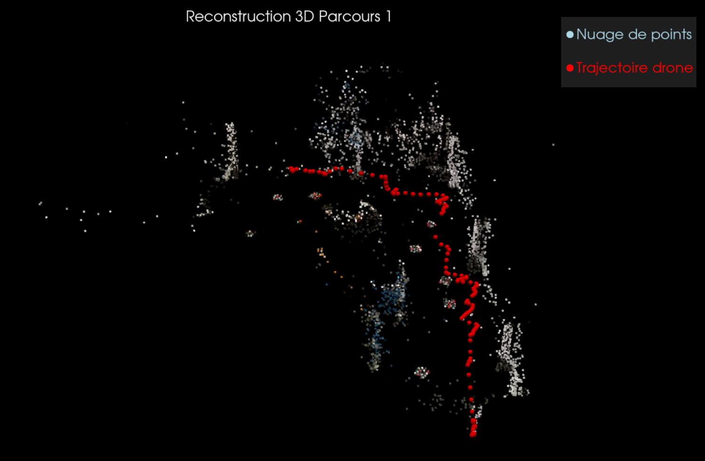
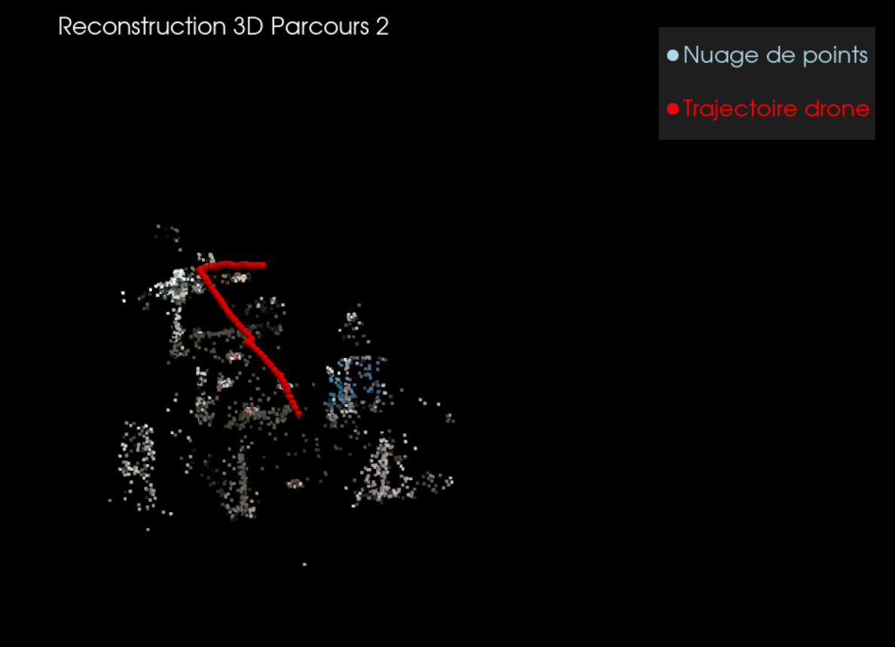
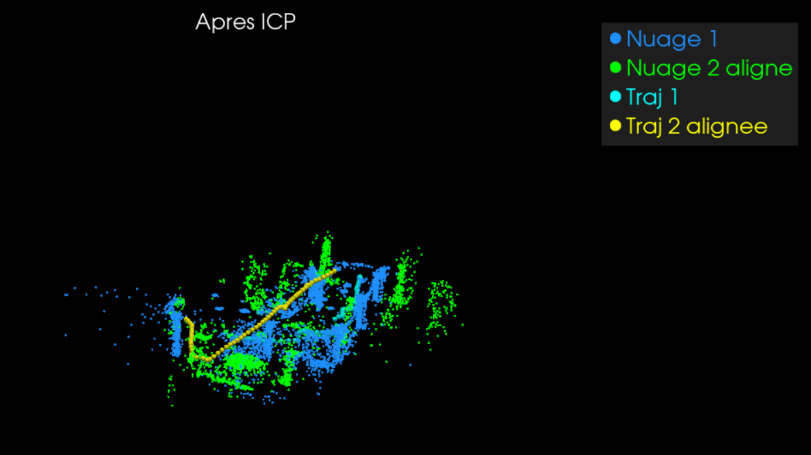
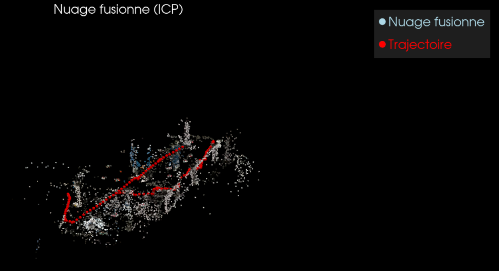

# **SLAM — Reconstruction de nuage de points à partir d'un drone**

> **Auteurs** : Youri Larose - Maxence Robineau - Nathan Houel

## 📝 **Description**

Ce projet développe une pipeline de reconstruction 3D par **Structure-from-Motion (SfM)** à partir d'images capturées par un drone DJI Tello, avec **fusion multi-parcours par ICP**. Les principales librairies utilisées sont **pycolmap** (bindings Python de COLMAP) pour le SfM et **PyVista** pour la visualisation interactive.

## 🎮 **Acquisition des images**

Afin de collecter l'ensemble des images, nous avons utilisé et modifié le script C++ de J.Gangloff afin de contrôler le drone Tello (script disponible dans le dossier `\Drone`).  

Nous avons donc réaliser deux fois le même parcours avec le drone, un rectangle dans l'Innovlab, en modifiant l'emplacement des éléments entre les deux parcours.  
Pour acquérir les images nous avons pris 2 photos par secondes, ce qui nous fait des datasets d'environ 200 images pour chaque parcours.  

Une fois les images acquises, nous avons réaliser un traitement des images en supprimant les images floues etc...  
Toutes les images sont disponibles dans le dossier `\Images`.


## 🛠️ **Installation**

### Prérequis

- **Python** 3.9+
- **GPU NVIDIA avec CUDA** pour accélérer l'extraction SIFT et le matching

```powershell
python -m venv .venv
.\.venv\Scripts\activate
pip install -r requirements.txt
```

## 📖 **Scripts**

### 1. `slam_reconstruction.py` — Reconstruction SfM

Ce script permet d'exécuter la pipeline complète; c'est-à-dire : le crop des images, l'extraction SIFT, le matching séquentiel, la reconstruction sparse, l'export PLY et la visualisation.

```powershell
# Reconstruction complète
python slam_reconstruction.py --clean

# Choisir un parcours différent
python slam_reconstruction.py --images Images/parcours_2 --output output_p2 --clean

# Sans visualisation
python slam_reconstruction.py --clean --no-viz

# Visualiser un résultat existant
python slam_reconstruction.py --viz-only output/sparse/nuage_sparse_filtre.ply

# Ajuster le filtrage de distance
python slam_reconstruction.py --clean --max-dist 5.0

# Désactiver le crop
python slam_reconstruction.py --clean --crop-top 0
```

#### Options

| Option           | Défaut            | Description                                          |
|------------------|-------------------|------------------------------------------------------|
| `--images`, `-i` | `Images/parcours_1` | Chemin vers le dossier d'images                   |
| `--output`, `-o` | `output`         | Dossier de sortie                                    |
| `--clean`        | —                 | Supprimer le dossier de sortie avant de relancer     |
| `--no-viz`       | —                 | Ne pas lancer la visualisation 3D                    |
| `--viz-only`     | —                 | Visualiser un fichier PLY existant                   |
| `--overlap`      | `15`              | Nb d'images voisines pour le matching séquentiel     |
| `--max-features` | `8192`            | Nb max de features SIFT par image                    |
| `--no-gpu`       | —                 | Forcer le CPU                                        |
| `--gpu-index`    | `0`               | Index du GPU à utiliser                              |
| `--crop-top`     | `25`              | % du haut de l'image à couper (0 = désactivé)       |
| `--max-dist`     | `0`               | Rayon max de filtrage (0 = auto via box-plot Q75+1.5×IQR) |

---

### 2. `merge_icp.py` — Fusion de nuages par ICP

Ce second script fusionne deux nuages de points `.ply` issus de parcours différents via un recalage **ICP multi-échelle** (Iterative Closest Point). Il n'était pas possible d'implémenté avec Open3D dû à la version de Python, nous avons donc utilisé scipy, numpy et pyvista.

```powershell
# Fusion de base avec visualisation
python merge_icp.py output/sparse/nuage_sparse_filtre.ply output2/sparse/nuage_sparse_filtre.ply --viz

# Spécifier un fichier de sortie
python merge_icp.py output/sparse/nuage_sparse_filtre.ply output2/sparse/nuage_sparse_filtre.ply -o resultat.ply

# Avec sous-échantillonnage pour accélérer l'ICP
python merge_icp.py output/sparse/nuage_sparse_filtre.ply output2/sparse/nuage_sparse_filtre.ply --voxel-size 0.05 --viz

# Sans alignement initial (ICP brut)
python merge_icp.py output/sparse/nuage_sparse_filtre.ply output2/sparse/nuage_sparse_filtre.ply --no-initial --viz
```

#### Options

| Option           | Défaut            | Description                                          |
|------------------|-------------------|------------------------------------------------------|
| `ply1`           | —                 | Nuage cible (référence)                              |
| `ply2`           | —                 | Nuage source (sera aligné sur le premier)            |
| `--output`, `-o` | `merged_icp.ply`  | Fichier de sortie                                    |
| `--voxel-size`   | `0.0`             | Taille du voxel pour sous-échantillonner avant ICP   |
| `--max-iter`     | `200`             | Itérations max pour ICP                              |
| `--tolerance`    | `1e-7`            | Seuil de convergence                                 |
| `--max-dist`     | `0`               | Distance max pour rejeter les outliers (0 = auto)    |
| `--traj1`        | auto              | Trajectoire du nuage cible (`.ply`, auto-détectée)   |
| `--traj2`        | auto              | Trajectoire du nuage source (`.ply`, auto-détectée)  |
| `--traj-points`  | `10`              | Nb de points de trajectoire pour l'alignement initial|
| `--no-initial`   | —                 | Pas d'alignement initial                             |
| `--dedup`        | `0.0`             | Taille voxel pour déduplications après fusion        |
| `--viz`          | —                 | Visualiser avant/après + résultat fusionné           |

#### Fonctionnalités

- **Pré-rotations automatiques** des nuages pour corriger l'orientation (flip vertical/horizontal)
- **Alignement initial par trajectoires** (fin traj1 ↔ début traj2), fallback PCA ou centroïdes
- **ICP multi-échelle** (4 passes : voxel×4, ×2, ×1, résolution complète) avec rejet progressif d'outliers
- **Mise sur le même plan Z** avant ICP pour garantir la cohérence spatiale
- **Visualisation 3 fenêtres** : avant ICP, après ICP, nuage fusionné (avec trajectoires)

## 📂 **Fichiers générés**

```
├── 📁 Drone
│   ├── 📁 CMakeFiles
│   ├── 📁 src
│   │   ├── ⚡ main.cpp
│   │   ├── ⚡ main_older.cpp
│   │   ├── ⚡ main_save.cpp
│   │   └── ⚡ tello.hpp
│   ├── 📄 CMakeLists.txt
│   ├── 📄 Makefile
│   ├── 📄 README
│   └── 📄 cmake_install.cmake
├── 📁 Images
│   ├── 📁 parcours_1
│   └── 📁 parcours_2
├── 📁 Results
│   ├── 🖼️ ICP1.png
│   ├── 🖼️ ICP2.png
│   ├── 🖼️ Parcours1.png
│   └── 🖼️ Parcours2.png
├── 📁 output
│   ├── 📁 images_cropped
│   ├── 📁 sparse
│   │   ├── 📁 0
│   │   │   ├── ⚙️ cameras.bin
│   │   │   ├── ⚙️ frames.bin
│   │   │   ├── ⚙️ images.bin
│   │   │   ├── ⚙️ points3D.bin
│   │   │   └── ⚙️ rigs.bin
│   │   ├── 📁 1
│   │   ├── 📁 2
│   │   ├── 📁 3
│   │   ├── 📁 4
│   │   ├── 📄 nuage_sparse.ply
│   │   ├── 📄 nuage_sparse_filtre.ply
│   │   └── 📄 trajectoire_drone.ply
│   └── 📄 database.db
├── 📁 output2
│   ├── 📁 images_cropped
│   ├── 📁 sparse
│   │   ├── 📁 0
│   │   ├── 📁 1
│   │   ├── 📁 2
│   │   ├── 📁 3
│   │   ├── 📄 nuage_sparse.ply
│   │   ├── 📄 nuage_sparse_filtre.ply
│   │   └── 📄 trajectoire_drone.ply
│   └── 📄 database.db
├── ⚙️ .gitignore
├── 📝 README.md
├── 🐍 merge_icp.py
├── 📄 merged_icp.ply
├── 📄 requirements.txt
└── 🐍 slam_reconstruction.py
```

## 🎮 **Contrôles de la visualisation 3D dans PyVista**

| Contrôle              | Action      |
|-----------------------|-------------|
| Clic gauche + glisser | Rotation    |
| Molette               | Zoom        |
| Clic droit + glisser  | Translation |
| `R`                   | Reset vue   |
| `Q`                   | Quitter     |

## 📊​ **Résultats obtenus**

### Reconstruction 3D

Voici la reconstruction 3D obtenue pour le parcours 1 :



Comme on peut le remarquer, la reconstruction n'arrive pas à reconstruire l'ensemble de la trajectoire. Cela est dû à la qualité de la caméra du drone et de son manque de degré de liberté. 

À l'inverse, la reconstruction 3D pour le parcours 2 reconstruit seulement la partie manquante : 



### Fusion ICP

Afin d'avoir une reconstruction complète, nous avons essayer de fusionner les deux nuages de points à l'aide de la méthode ICP.

Voici les résultats obtenues :





Comme on peut le remarquer, la reconstruction obtenue n'est pas du tout convincante car les nuages de points ne sont pas dans le même sens rendant l'alignement impossible.

